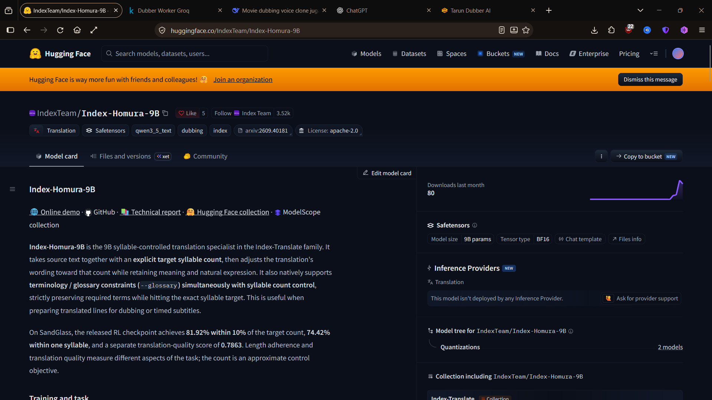

  

 
 

    <strong>An end-to-end cloud-accelerated movie dubbing architecture.</strong>
     
     

 

# T_Dubber

T_Dubber is a robust, zero-cost video dubbing infrastructure that leverages Kaggle GPU environments and open-source models (Index-Homura-9B, Faster-Whisper, Mazinger) to extract, transcribe, translate, and synthesize localized audio. It is built for developers who require high-quality syllable-controlled dubbing without the overhead of expensive proprietary APIs.

Built with architectural depth — including automated compression, distributed cloud workers, and real-time polling — for professional studio-grade outputs, not surface-level script wrappers.

## Core Capabilities

| System Component | Execution Environment | Technical Function |
|-----------------|-----------------------|--------------------|
| **Control Node** | Local Client | Gradio interface, telemetry polling, file validation |
| **Ingestion** | Local to Cloud | FFmpeg auto-compression, Kaggle dataset staging |
| **Compute Node** | Kaggle GPU Worker | VAD, transcription, LLM translation, audio synthesis |
| **Output Delivery** | Cloud to Local | Secured artifact retrieval and timeline synchronization |

## Architecture Roadmap

We are executing a structured rollout. Rather than viewing upcoming phases as incomplete, they represent the escalating scale of the architecture.

### Phase 0: Foundation & Ingestion (Deployed)
The core infrastructure is live. Local environments securely authenticate with Kaggle via `kaggle.json`. Project telemetry and foundational scripts (`app.py`, `pipeline.py`, `kaggle_worker.ipynb`) are established. The data pipeline successfully handles dummy ingestions and cloud handoffs.

### Phase 1: MVP Cloud Execution (Deployed)
The primary dubbing pipeline is operational. The Gradio UI orchestrates the workflow. Local nodes automatically sync video payloads to Kaggle. The GPU worker (`kaggle_worker.ipynb`) executes the Mazinger stack. Real-time polling tracks worker states and fetches error logs. Final dubbed assets are successfully retrieved. 
*Next Iteration: Decoupling OpenAI dependencies in favor of Groq API endpoints.*

### Phase 2: Intelligence & Storage (Vision)
Expanding the system's analytical capabilities. Implementation of multi-speaker detection algorithms to assign distinct synthesized voices. Integration of a comprehensive quality dashboard tracking WER (Word Error Rate), Sync Offsets, and Speaker Similarity scores. Implementation of `telegram_backup.py` to offload final artifacts to Telegram cloud storage, optimizing local hardware memory.

### Phase 3: Synchronization & Scale (Vision)
Advanced visual synchronization using Wav2Lip arrays for pixel-perfect lip mapping. Introduction of resilient connection handling to resume interrupted Kaggle executions. Deployment of a dynamic GPU Worker Manager for seamless failover between Kaggle, Google Colab, and Lightning AI. Integration of DPAPI for encrypted credential management.

 

<table>
<tr>
<td align="center" width="100%">

<h4>Build the future of localized content with open-source infrastructure.</h4>

A community resource engineered for developers and creators.

</td>
</tr>
</table>

## System Requirements

- **Python:** Version 3.10 or higher.
- **FFmpeg:** Required on the system PATH for local compression and audio extraction.
- **Kaggle API:** Valid `kaggle.json` provisioned in the configuration directory.

## License

MIT License - see LICENSE.

This repository orchestrates public cloud compute and open-source models. The referenced models and inference wrappers are subject to their respective licenses.
